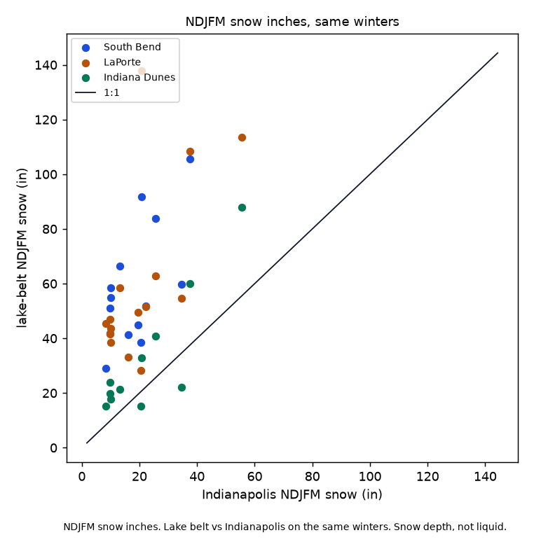
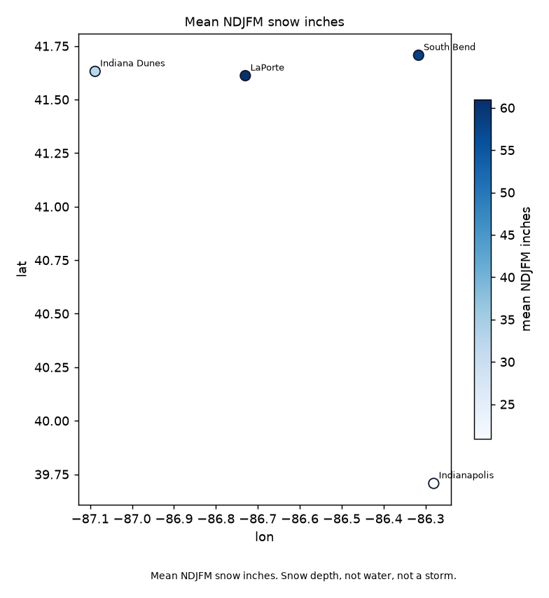

# NWI lake-effect snow

Does the NWI lake belt get more NDJFM snow days and snow inches than inland Indiana on the same winters?

Yes. On 40 paired station-winters (NDJFM 2010-11 through 2024-25), the belt averaged 31.81 in more snow than Indianapolis and 9.55 more snow days. The belt was snowier in inches in 0.95 of those pairs. Snow depth, not liquid.

Michigan City GHCND `USC00125604` and Valparaiso Porter County Airport `USW00004846` have no complete NDJFM SNOW in that window. The belt that can be scored is South Bend, LaPorte, and Indiana Dunes NP. CoCoRaHS snow was skipped; daily liquid is not a snow label.

Amount science `ac36f0f`, JJA miss `1416da1`, winter-lake miss `6b47f21`, and DJF snow holdout `9aa7935` stay frozen. GaugeCorr stays out.

Write-up: https://gist.github.com/martialsystems/b5f900aad37487bb8c0206a321c1ed5c  
Research index: https://gist.github.com/martialsystems/66b896b0a4a0b8cba2b478aef64312f3



Figure 1. NDJFM snow inches. Lake belt vs Indianapolis on the same winters. Snow depth, not liquid.



Figure 2. Mean NDJFM snow inches. Snow depth, not water, not a storm.

## Live contrast (same winters)

Locked from `logs/in_live/stage_c_report.json`. Inches. GHCND SNOW.

| Station | n winters | Mean NDJFM (in) | vs Indianapolis (in) | vs Indianapolis (days) |
|---------|----------:|----------------:|---------------------:|-----------------------:|
| South Bend USW00014848 | 14 | 58.49 | +40.06 | +16.93 |
| LaPorte USC00124837 | 15 | 60.95 | +40.04 | +9.33 |
| Indiana Dunes USC00124244 | 11 | 32.42 | +10.10 | +0.45 |
| Indianapolis USW00093819 | 15 | 20.91 | 0 | 0 |

1991-2020 NDJFM snowfall normals: South Bend 63.3, LaPorte 63.9, Indiana Dunes 39.7, Indianapolis 25.2.

## Stage 0

Fixture winters with planted lake-belt snow over Indianapolis. That does not rescue live skill.

```bash
python3.12 -m venv .venv
source .venv/bin/activate
pip install -r requirements.txt
PYTHONPATH=src:. python3 scripts/run_fixture.py logs/stage0_fixture
.venv/bin/python -m pytest tests -q
PYTHONPATH=src:. python3 scripts/run_live.py logs/in_live data/raw
```

Do not use stock `/usr/bin/python3 -m pytest`. Empty GHCND SNOW at a pinned belt station stops (`run_live.py` exit 2). Two figures max.

| File | Role |
|------|------|
| [METHODOLOGY.md](METHODOLOGY.md) | Locked contract |
| [AGENTS.md](AGENTS.md) | Agent rules |
| [CHECKLIST.md](CHECKLIST.md) | Operator list |
| `src/nwisnow/` | GHCND SNOW, NDJFM totals, paired inland contrast, figures |

MIT. Martial Systems LLC.
